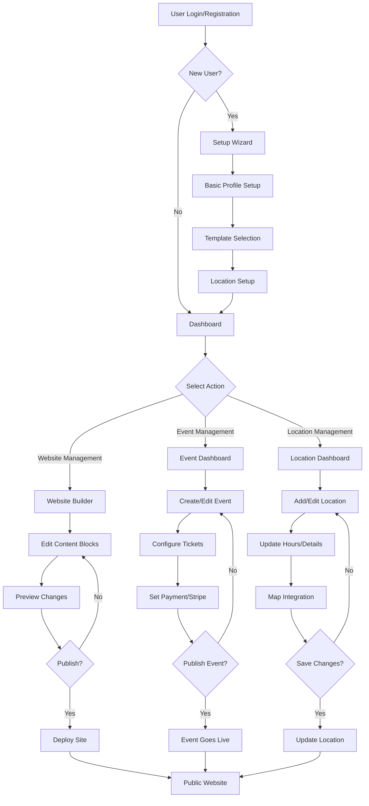
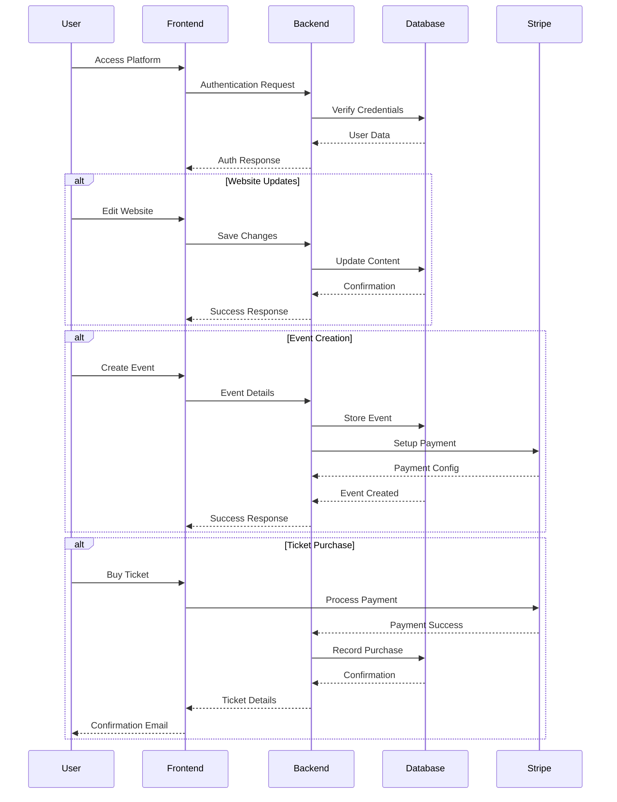
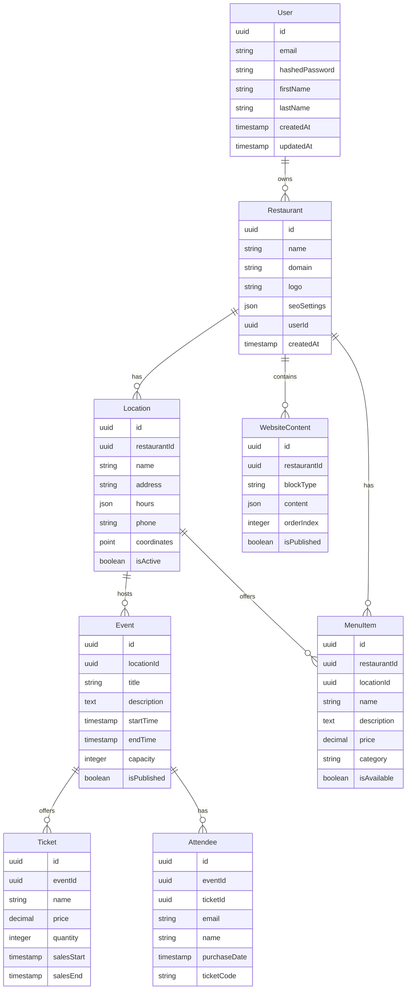
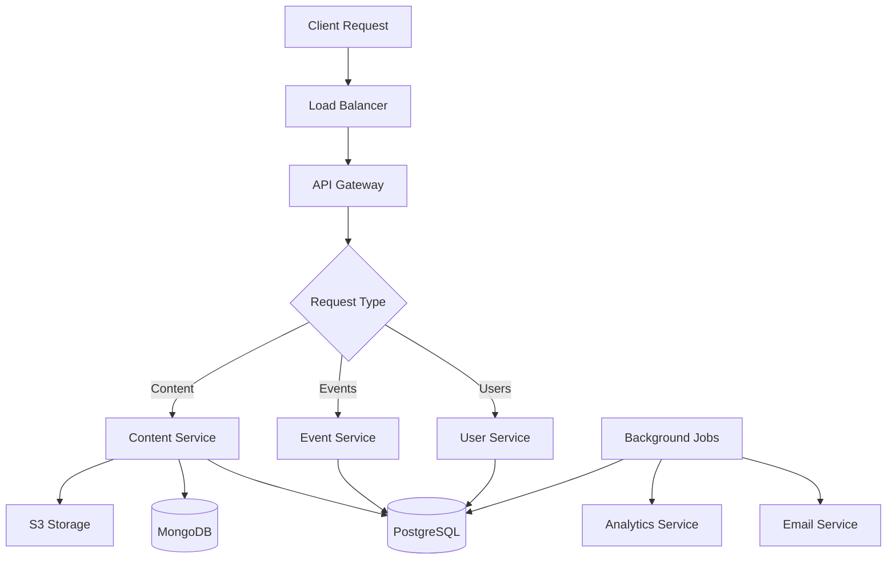
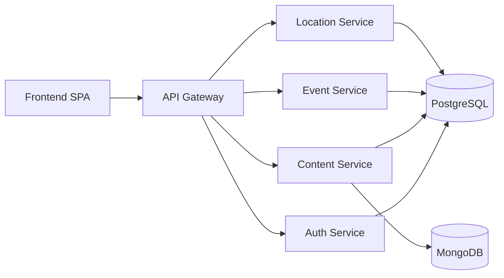

# Product Requirements Document (PRD)

# 1. INTRODUCTION

## 1.1 Purpose

This Software Requirements Specification (SRS) document provides a comprehensive description of the Digital Presence MVP for Small Restaurants platform. It details the functional and non-functional requirements for stakeholders including:

- Development team
- Project managers
- Quality assurance team
- Business stakeholders
- Future maintenance teams

## 1.2 Scope

The Digital Presence MVP platform is a web-based solution enabling small restaurant owners to establish and manage their online presence through:

- Website creation using a drag-and-drop builder supporting up to 3 locations
- Event management and ticketing system
- Integration with payment processors

### In Scope:

- Restaurant-specific website templates and content blocks
- Basic SEO and domain management
- Event creation and ticket sales
- Multi-location management (up to 3 locations)
- Payment processing via Stripe
- Admin dashboard for site and event management

### Out of Scope:

- Advanced website customization features
- Online ordering/delivery integration
- Customer loyalty programs
- Reservation systems
- Support for more than 3 locations
- Custom payment gateway integrations

The system will be built using React/Next.js for the frontend, Node.js for the backend, and PostgreSQL/MongoDB for data storage, with AI assistance through Blitzy for development acceleration.

# 2. PRODUCT DESCRIPTION

## 2.1 Product Perspective

The Digital Presence MVP platform operates as a standalone web-based SaaS solution while integrating with the following external systems:

- Domain registrars for custom domain connections
- Stripe payment processing for ticket sales
- Google Maps API for location display
- Cloud storage services for media assets
- Email delivery services for notifications

The system architecture follows a modern microservices approach with:

- React/Next.js frontend hosted on Vercel
- Node.js backend services
- PostgreSQL/MongoDB databases
- REST APIs for service communication

## 2.2 Product Functions

The platform provides the following core functions:

1. Website Builder

   - Drag-and-drop interface
   - Template selection and customization
   - Content block management
   - Domain and SEO configuration

2. Event Management

   - Event creation and publishing
   - Ticket type configuration
   - Payment processing
   - Attendee tracking

3. Location Management

   - Multi-location profile creation
   - Location-specific content management
   - Event-location association
   - Hours and contact information

4. Admin Dashboard

   - Analytics overview
   - Content management
   - User account administration
   - Event and ticket reporting
   - Display restaurant menu

## 2.3 User Characteristics

### Primary Users: Restaurant Owners/Managers

- Technical Proficiency: Basic to intermediate
- Device Usage: Desktop primary, mobile secondary
- Time Availability: Limited, requires quick task completion
- Expected Usage Frequency: Weekly for content updates, daily during events

### Secondary Users: Event Coordinators

- Technical Proficiency: Intermediate
- Focus Area: Event creation and ticket management
- Usage Pattern: Regular event setup and monitoring

### End Users: Restaurant Customers

- Technical Proficiency: Various levels
- Device Usage: Mobile primary, desktop secondary
- Interaction: Viewing website content and purchasing event tickets

## 2.4 Constraints

### Technical Constraints

- Maximum of 3 location profiles per account
- Limited template customization options
- Stripe-only payment processing
- Mobile-responsive design requirement
- Maximum file size limits for uploads

### Business Constraints

- MVP budget limitations
- 1-month development timeline
- Small development team size (1-2 members)
- Blitzy AI assistance integration requirement

### Regulatory Constraints

- GDPR compliance for user data
- PCI compliance for payment processing
- ADA accessibility requirements
- Cookie consent requirements

## 2.5 Assumptions and Dependencies

### Assumptions

- Users have basic computer literacy
- Stable internet connectivity
- Access to business documentation for setup
- Basic understanding of event management
- Ability to provide digital content (photos, menu items)

### Dependencies

- Stripe API availability and stability
- Domain registrar API integration
- Cloud storage service reliability
- Blitzy AI service availability
- Third-party API rate limits and pricing
- Browser compatibility (latest 2 versions)
- Mobile device compatibility (iOS 14+, Android 10+)

# 3. PROCESS FLOWCHART





# 4. FUNCTIONAL REQUIREMENTS

## 4.1 Website Builder Features

### F1: Template Selection and Management

**Priority: High**
**Description:** Users can select and customize pre-built restaurant website templates.

| Requirement ID | Requirement Description | Acceptance Criteria |
| --- | --- | --- |
| F1.1 | System provides minimum 3 restaurant-specific templates | - Templates are mobile-responsive<br>- Templates include all core sections<br>- Preview functionality available |
| F1.2 | Users can customize template colors and fonts | - Color picker available<br>- Pre-defined font combinations<br>- Live preview of changes |
| F1.3 | Template changes persist across sessions | - Auto-save functionality<br>- Version history maintained<br>- Ability to revert changes |

### F2: Content Block Management

**Priority: High**
**Description:** Drag-and-drop interface for managing website content blocks.

| Requirement ID | Requirement Description | Acceptance Criteria |
| --- | --- | --- |
| F2.1 | Support for core content blocks | - Header block<br>- About block<br>- Menu block<br>- Gallery block<br>- Contact block<br>- Footer block |
| F2.2 | Drag-and-drop functionality | - Visual indicators for drag actions<br>- Snap-to-grid placement<br>- Block reordering |
| F2.3 | Content block customization | - Text editing<br>- Image upload<br>- Layout options |

## 4.2 Event Management Features

### F3: Event Creation and Management

**Priority: High**
**Description:** Tools for creating and managing ticketed events.

| Requirement ID | Requirement Description | Acceptance Criteria |
| --- | --- | --- |
| F3.1 | Event creation interface | - Event details form<br>- Date/time picker<br>- Location selection<br>- Image upload |
| F3.2 | Ticket configuration | - Multiple ticket types<br>- Pricing options<br>- Quantity limits<br>- Sale duration settings |
| F3.3 | Event publishing controls | - Draft/publish toggle<br>- Preview functionality<br>- Event status indicators |

### F4: Ticket Sales and Processing

**Priority: High**
**Description:** Payment processing and ticket management system.

| Requirement ID | Requirement Description | Acceptance Criteria |
| --- | --- | --- |
| F4.1 | Stripe payment integration | - Secure checkout flow<br>- Payment confirmation<br>- Error handling |
| F4.2 | Ticket delivery | - Email confirmation<br>- Digital ticket generation<br>- QR code support |
| F4.3 | Sales tracking | - Real-time inventory<br>- Sales reports<br>- Revenue analytics |

## 4.3 Location Management Features

### F5: Multi-location Support

**Priority: Medium**
**Description:** Management of up to 3 restaurant locations.

| Requirement ID | Requirement Description | Acceptance Criteria |
| --- | --- | --- |
| F5.1 | Location profile creation | - Address input<br>- Hours configuration<br>- Contact information<br>- Google Maps integration |
| F5.2 | Location-specific content | - Unique menus per location<br>- Custom images<br>- Specific events assignment |
| F5.3 | Location overview page | - List view of all locations<br>- Interactive map<br>- Filtering options |

### F6: Domain and SEO Management

**Priority: Medium**
**Description:** Domain connection and basic SEO configuration.

| Requirement ID | Requirement Description | Acceptance Criteria |
| --- | --- | --- |
| F6.1 | Domain management | - Subdomain creation<br>- Custom domain connection<br>- SSL configuration |
| F6.2 | SEO settings | - Meta title/description editor<br>- URL slug customization<br>- Sitemap generation |
| F6.3 | Analytics integration | - Basic traffic metrics<br>- Event tracking<br>- Performance reporting |

## 4.4 Admin Dashboard Features

### F7: User Management

**Priority: High**
**Description:** Administrative controls for user accounts and permissions.

| Requirement ID | Requirement Description | Acceptance Criteria |
| --- | --- | --- |
| F7.1 | User authentication | - Secure login/logout<br>- Password reset<br>- Session management |
| F7.2 | Profile management | - Account settings<br>- Notification preferences<br>- Billing information |
| F7.3 | Access control | - Role-based permissions<br>- Feature access limits<br>- User activity logs |

# 5. NON-FUNCTIONAL REQUIREMENTS

## 5.1 Performance Requirements

| Requirement | Description | Target Metric |
| --- | --- | --- |
| Response Time | Maximum time for page loads | \< 3 seconds at 95th percentile |
| API Response | Maximum time for API requests | \< 500ms at 95th percentile |
| Concurrent Users | Supported simultaneous users | 500 per instance |
| Image Loading | Maximum image load time | \< 2 seconds for optimized images |
| Database Queries | Query execution time | \< 200ms for 95% of queries |
| Event Processing | Ticket transaction processing | \< 2 seconds per transaction |

## 5.2 Safety Requirements

| Requirement | Description | Implementation |
| --- | --- | --- |
| Data Backup | Regular automated backups | Daily incremental, weekly full backups |
| Failover | System redundancy | Multi-zone deployment with automatic failover |
| Data Recovery | Recovery Point Objective (RPO) | \< 24 hours |
| System Recovery | Recovery Time Objective (RTO) | \< 4 hours |
| Error Handling | Graceful failure management | Fallback pages, error logging, user notifications |
| Transaction Safety | Payment processing integrity | Atomic transactions, rollback capability |

## 5.3 Security Requirements

| Requirement | Description | Implementation |
| --- | --- | --- |
| Authentication | User identity verification | JWT-based authentication, MFA support |
| Authorization | Access control | Role-based access control (RBAC) |
| Data Encryption | Data protection | TLS 1.3 in transit, AES-256 at rest |
| Session Management | User session control | 30-minute timeout, secure cookie handling |
| Input Validation | Request sanitization | Server-side validation, XSS prevention |
| API Security | API access control | Rate limiting, API keys, request validation |

## 5.4 Quality Requirements

### 5.4.1 Availability

- System uptime: 99.9% excluding planned maintenance
- Planned maintenance windows: Between 2 AM - 4 AM local time
- Maximum unplanned downtime: 4 hours per month

### 5.4.2 Maintainability

- Code documentation coverage: Minimum 80%
- Automated test coverage: Minimum 70%
- Modular architecture with clear separation of concerns
- Standardized logging and monitoring

### 5.4.3 Usability

- Mobile-responsive design for all screens
- WCAG 2.1 Level AA compliance
- Maximum 3 clicks to reach any feature
- Consistent UI/UX patterns across platform

### 5.4.4 Scalability

- Horizontal scaling capability
- Auto-scaling based on load metrics
- Database partitioning support
- CDN integration for static assets

### 5.4.5 Reliability

- Maximum 0.1% error rate for all API endpoints
- Automated health checks every 5 minutes
- Automatic retry mechanism for failed operations
- Data consistency checks daily

## 5.5 Compliance Requirements

| Requirement | Description | Implementation |
| --- | --- | --- |
| GDPR | Data privacy compliance | User consent management, data export, deletion capability |
| PCI DSS | Payment security | Stripe compliance, no direct card data storage |
| CCPA | California privacy law | Data tracking disclosure, opt-out mechanisms |
| ADA | Accessibility compliance | WCAG 2.1 Level AA standards |
| Cookie Law | Cookie consent | Cookie banner, preference management |
| Data Retention | Data storage policies | Automated data cleanup after retention period |

# 6. DATA REQUIREMENTS

## 6.1 Data Models



## 6.2 Data Storage

### 6.2.1 Database Configuration

- Primary Database: PostgreSQL for transactional data
- Document Store: MongoDB for flexible content blocks
- File Storage: AWS S3 for media assets

### 6.2.2 Data Retention

- User Data: 7 years after account deletion
- Event Data: 3 years after event completion
- Transaction Records: 7 years (legal requirement)
- Media Assets: 1 year if unused
- Logs: 90 days rolling retention

### 6.2.3 Backup Strategy

- Full Database Backup: Weekly
- Incremental Backups: Daily
- Transaction Logs: Real-time replication
- Backup Storage: Geo-redundant cloud storage
- Retention: 30 days for daily backups, 1 year for weekly backups

### 6.2.4 Recovery Procedures

- Point-in-time recovery capability
- Automated failover with 99.99% uptime SLA
- Maximum data loss threshold: 15 minutes
- Recovery time objective (RTO): 4 hours
- Recovery point objective (RPO): 24 hours

## 6.3 Data Processing

### 6.3.1 Data Flow



### 6.3.2 Data Security

- Encryption at rest: AES-256
- Encryption in transit: TLS 1.3
- Data classification levels:
  - Public: Website content, event details
  - Private: User profiles, contact information
  - Sensitive: Payment data (handled by Stripe)

### 6.3.3 Data Validation

- Input sanitization on all API endpoints
- Schema validation using Zod/Joi
- Type checking with TypeScript
- Business rule validation layer

### 6.3.4 Data Transformation

- Image optimization pipeline
  - Automatic resizing
  - Format conversion
  - Compression
- Content versioning
- SEO metadata generation
- Analytics data aggregation

### 6.3.5 Caching Strategy

- Redis for session data
- CDN for static assets
- Application-level caching
  - Public content: 1 hour
  - User data: 5 minutes
  - Event data: 1 minute

# 7. EXTERNAL INTERFACES

## 7.1 User Interfaces

### 7.1.1 General UI Requirements

- Responsive design supporting viewport sizes from 320px to 4K
- Consistent color scheme and typography across all interfaces
- Maximum 3-click navigation depth
- Loading state indicators for all async operations
- Error feedback within 100ms of failure
- Touch-friendly elements (minimum 44x44px tap targets)

### 7.1.2 Primary Interface Components

| Interface | Description | Key Requirements |
| --- | --- | --- |
| Website Builder | Drag-and-drop interface | - Visual grid system<br>- Component library panel<br>- Real-time preview<br>- Undo/redo functionality |
| Event Manager | Event creation and management | - Calendar view<br>- List view<br>- Ticket configuration panel<br>- Sales dashboard |
| Location Manager | Multi-location administration | - Map interface<br>- Location list view<br>- Hours editor<br>- Contact information forms |
| Admin Dashboard | Central control panel | - Analytics widgets<br>- Quick action buttons<br>- Notification center<br>- Settings panels |

## 7.2 Software Interfaces

### 7.2.1 External Service Integration

| Service | Purpose | Integration Method |
| --- | --- | --- |
| Stripe API | Payment processing | REST API with webhook events |
| Google Maps API | Location visualization | JavaScript SDK |
| Domain Registrar APIs | Domain management | REST API |
| AWS S3 | Media storage | AWS SDK |
| SendGrid | Email notifications | REST API |

### 7.2.2 Internal Service Communication



## 7.3 Communication Interfaces

### 7.3.1 API Specifications

| Interface Type | Protocol | Format | Security |
| --- | --- | --- | --- |
| REST APIs | HTTPS | JSON | JWT Authentication |
| WebSocket | WSS | JSON | Token-based |
| File Transfer | HTTPS | Multipart | Signed URLs |
| Email | SMTP | MIME | TLS |

### 7.3.2 Data Exchange Formats

```json
{
  "content": {
    "version": "1.0",
    "encoding": "UTF-8",
    "formats": {
      "api": "application/json",
      "images": ["image/jpeg", "image/png", "image/webp"],
      "documents": ["application/pdf"],
      "exports": ["application/csv", "application/json"]
    }
  }
}
```

### 7.3.3 Integration Points

| System | Integration Type | Data Flow | Protocol |
| --- | --- | --- | --- |
| Frontend to Backend | REST API | Bidirectional | HTTPS |
| Backend to Database | Database Driver | Bidirectional | TCP |
| Media Upload | S3 API | Upload | HTTPS |
| Payment Processing | Stripe API | Bidirectional | HTTPS |
| Email Service | SMTP | Outbound | SMTP/TLS |

## 7.4 Hardware Interfaces

### 7.4.1 Deployment Infrastructure

| Component | Specification | Provider |
| --- | --- | --- |
| Web Servers | Virtual CPU: 2 cores<br>RAM: 4GB<br>Storage: 20GB SSD | Vercel |
| Database Servers | Virtual CPU: 4 cores<br>RAM: 8GB<br>Storage: 100GB SSD | AWS RDS |
| Cache Servers | Memory: 2GB<br>Network: 1Gbps | Redis Cloud |
| Load Balancers | Throughput: 1000 req/s | Cloud Provider |

### 7.4.2 Client Requirements

| Device Type | Minimum Requirements |
| --- | --- |
| Desktop | CPU: 1.6GHz<br>RAM: 4GB<br>Display: 1024x768<br>Browser: Chrome 90+, Firefox 90+, Safari 14+ |
| Mobile | OS: iOS 14+ or Android 10+<br>RAM: 2GB<br>Display: 320px minimum width |
| Tablet | OS: iPadOS 14+ or Android 10+<br>RAM: 2GB<br>Display: 768px minimum width |

# 8. APPENDICES

## 8.1 GLOSSARY

| Term | Definition |
| --- | --- |
| Content Block | Pre-built website section that can be customized and arranged using the drag-and-drop interface |
| Drag-and-Drop | User interface pattern allowing elements to be moved and positioned by clicking and dragging |
| Multi-location | Support for managing multiple restaurant locations (up to 3) under a single account |
| Template | Pre-designed website layout specifically created for restaurant websites |
| Webhook | HTTP callback that occurs when a specific event happens in the system |
| Microservices | Software architecture pattern where applications are built as independent, loosely coupled services |

## 8.2 ACRONYMS

| Acronym | Definition |
| --- | --- |
| API | Application Programming Interface |
| AWS | Amazon Web Services |
| CDN | Content Delivery Network |
| GDPR | General Data Protection Regulation |
| JWT | JSON Web Token |
| MFA | Multi-Factor Authentication |
| MVP | Minimum Viable Product |
| PCI DSS | Payment Card Industry Data Security Standard |
| RBAC | Role-Based Access Control |
| REST | Representational State Transfer |
| S3 | Simple Storage Service |
| SDK | Software Development Kit |
| SEO | Search Engine Optimization |
| SPA | Single Page Application |
| SSL | Secure Sockets Layer |
| TLS | Transport Layer Security |
| UI/UX | User Interface/User Experience |
| WCAG | Web Content Accessibility Guidelines |
| WSS | WebSocket Secure |

## 8.3 ADDITIONAL REFERENCES

### Development Resources

- React Documentation: https://reactjs.org/docs
- Next.js Documentation: https://nextjs.org/docs
- Node.js Best Practices: https://github.com/goldbergyoni/nodebestpractices
- Stripe API Documentation: https://stripe.com/docs/api

### Design Standards

- Material Design Guidelines: https://material.io/design
- WCAG 2.1 Guidelines: https://www.w3.org/WAI/WCAG21/quickref/

### Security Standards

- OWASP Security Guidelines: https://owasp.org/www-project-web-security-testing-guide/
- PCI Compliance Guide: https://www.pcisecuritystandards.org/

### Testing Resources

- Jest Testing Framework: https://jestjs.io/docs
- React Testing Library: https://testing-library.com/docs/react-testing-library/intro/

### Infrastructure

- AWS Best Practices: https://aws.amazon.com/architecture/well-architected/
- MongoDB Design Patterns: https://www.mongodb.com/blog/post/building-with-patterns
- PostgreSQL Documentation: https://www.postgresql.org/docs/

### Compliance Resources

- GDPR Compliance Checklist: https://gdpr.eu/checklist/
- CCPA Compliance Guide: https://oag.ca.gov/privacy/ccpa