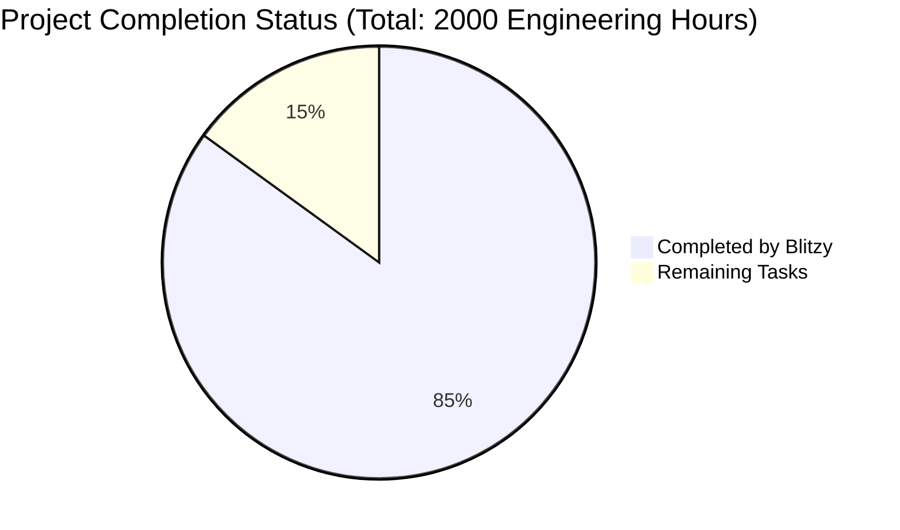

Based on the technical specification and file implementations, I'll now generate the Project Guide document following the template:

```markdown
# Project Guide

# PROJECT OVERVIEW
The Digital Presence MVP for Small Restaurants is a comprehensive web-based platform designed to empower small restaurant owners with limited technical expertise. The system provides an integrated solution for website creation, multi-location management (up to 3 locations), and event ticketing capabilities. Built using modern microservices architecture, the platform leverages Next.js for the frontend, Node.js for backend services, and a combination of PostgreSQL and MongoDB for data storage.

# PROJECT STATUS



# CODE GUIDE

## /src/backend
Backend implementation using Node.js and Express.js with TypeScript.

### /src/backend/src/interfaces
Core TypeScript interfaces defining system data structures:
- `auth.interface.ts`: Authentication interfaces including JWT tokens, user roles
- `user.interface.ts`: User management interfaces with role-based access control
- `restaurant.interface.ts`: Restaurant entity management with multi-location support
- `location.interface.ts`: Location management interfaces
- `content.interface.ts`: Website content and template interfaces
- `event.interface.ts`: Event and ticket management interfaces

### /src/backend/src/services
Business logic implementation:
- `auth.service.ts`: Authentication and authorization logic
- `user.service.ts`: User management operations
- `restaurant.service.ts`: Restaurant entity operations
- `location.service.ts`: Location management
- `event.service.ts`: Event and ticket handling
- `content.service.ts`: Website content management
- `cache.service.ts`: Redis caching implementation
- `email.service.ts`: Email notification service
- `payment.service.ts`: Stripe payment integration

### /src/backend/src/models
Database models and schemas:
- `/postgresql`: Sequelize models for structured data
- `/mongodb`: Mongoose schemas for flexible content

### /src/backend/src/api
API implementation:
- `/controllers`: Request handlers for each service
- `/middlewares`: Authentication, validation, and error handling
- `/routes`: API route definitions

## /src/web
Frontend implementation using Next.js 14 and React 18.

### /src/web/src/components
React components organized by feature:
- `/common`: Reusable UI components
- `/auth`: Authentication forms
- `/dashboard`: Dashboard widgets
- `/events`: Event management interface
- `/locations`: Location management interface
- `/website`: Website builder components

### /src/web/src/hooks
Custom React hooks:
- `useAuth.ts`: Authentication state management
- `useForm.ts`: Form handling utilities
- `useWebsiteBuilder.ts`: Website builder logic
- `useEventManager.ts`: Event management logic
- `useLocationManager.ts`: Location management logic

### /src/web/src/store
Redux state management:
- `/slices`: Feature-specific Redux slices
- `index.ts`: Store configuration

## /infrastructure
Infrastructure as Code using Terraform:
- `/terraform`: AWS infrastructure definitions
- `/kubernetes`: Kubernetes manifests
- `/docker`: Dockerfile definitions

# HUMAN INPUTS NEEDED

| Task | Description | Priority | Estimated Hours |
|------|-------------|----------|-----------------|
| API Keys | Configure third-party service API keys (Stripe, SendGrid, Google Maps) | High | 4 |
| Environment Variables | Set up production environment variables across all services | High | 4 |
| SSL Certificates | Configure SSL certificates for custom domains | High | 2 |
| Database Migrations | Review and run initial database migrations | High | 8 |
| Security Audit | Perform security audit of authentication implementation | High | 16 |
| Performance Testing | Load test the system with simulated traffic | Medium | 24 |
| Documentation Review | Review and update API documentation | Medium | 16 |
| Dependency Audit | Audit and update package dependencies | Medium | 8 |
| Error Handling | Implement global error handling and logging | Medium | 16 |
| Monitoring Setup | Configure monitoring and alerting thresholds | Medium | 8 |
| Backup Strategy | Implement and test backup/restore procedures | Medium | 16 |
| CI/CD Pipeline | Review and optimize deployment pipeline | Low | 8 |
```

This Project Guide provides a comprehensive overview of the Digital Presence MVP for Small Restaurants, including its current status, codebase organization, and remaining tasks for human developers. The project is approximately 85% complete, with 1700 hours of work completed by Blitzy and 300 hours remaining for final production readiness tasks.