# Technical Specifications

# 1. INTRODUCTION

## 1.1 Executive Summary

The Digital Presence MVP for Small Restaurants is a web-based platform designed to empower small restaurant owners with limited technical expertise to establish and manage their online presence. The system addresses the critical need for an affordable, user-friendly solution that combines website creation, multi-location management, and event ticketing capabilities. By leveraging AI-assisted development through Blitzy, the platform aims to deliver enterprise-grade functionality while maintaining simplicity and rapid time-to-market.

Primary stakeholders include independent restaurant owners managing 1-3 locations, event coordinators requiring ticketing functionality, and end customers accessing restaurant information and purchasing event tickets. The platform expects to reduce website development costs by 80% while enabling restaurant owners to launch their digital presence within 30 minutes.

## 1.2 System Overview

### Project Context

| Aspect | Description |
|--------|-------------|
| Market Position | Entry-level website builder specifically optimized for small restaurants |
| Target Segment | Independent restaurants with 1-3 locations requiring basic web presence and event capabilities |
| Competitive Edge | Integrated event ticketing, AI-assisted development, restaurant-specific templates |
| Enterprise Integration | Standalone system with Stripe payment processing and domain management integration |

### High-Level Description

The system architecture employs a modern microservices approach:

- Frontend: React/Next.js-based SPA with drag-and-drop website builder
- Backend: Node.js services handling content, events, and user management
- Database: PostgreSQL for structured data, MongoDB for flexible content
- AI Integration: Blitzy for accelerated development and code generation
- External Services: Stripe, domain providers, cloud storage

### Success Criteria

| Metric | Target |
|--------|---------|
| Time to Launch | < 30 minutes from signup to published website |
| Event Creation | < 15 minutes to create and publish an event |
| User Adoption | 80% of users successfully publish website |
| Platform Stability | 99.9% uptime excluding maintenance |
| Support Tickets | < 2 tickets per user in first month |

## 1.3 Scope

### In-Scope Elements

#### Core Features

| Category | Components |
|----------|------------|
| Website Builder | - Drag-and-drop interface<br>- Restaurant-specific templates<br>- Basic SEO management<br>- Mobile responsiveness |
| Event Management | - Event creation and publishing<br>- Ticket sales and management<br>- Payment processing<br>- Attendee tracking |
| Location Management | - Up to 3 location profiles<br>- Location-specific content<br>- Hours and contact management<br>- Map integration |

#### Implementation Boundaries

| Boundary Type | Coverage |
|--------------|----------|
| User Groups | Restaurant owners, managers, event coordinators |
| Geographic Scope | Global deployment, English language |
| Data Domains | Restaurant profiles, events, tickets, user accounts |
| Technical Scope | Web platform, mobile-responsive design |

### Out-of-Scope Elements

- Online ordering and delivery integration
- Reservation system functionality
- Customer loyalty programs
- Support for more than 3 locations
- Custom payment gateway integration
- Advanced website customization features
- Mobile applications
- Multi-language support
- Advanced analytics and reporting
- Third-party POS integration
- Inventory management
- Staff scheduling features

# 2. SYSTEM ARCHITECTURE

## 2.1 High-Level Architecture

```mermaid
C4Context
    title System Context Diagram - Digital Presence MVP

    Person(restaurant, "Restaurant Owner", "Manages website, events, and locations")
    Person(customer, "Customer", "Views website and purchases tickets")
    
    System_Boundary(platform, "Digital Presence Platform") {
        System(web, "Website Builder", "Creates and manages restaurant websites")
        System(events, "Event System", "Handles event and ticket management")
        System(locations, "Location Manager", "Manages multiple restaurant locations")
    }

    System_Ext(stripe, "Stripe", "Payment processing")
    System_Ext(maps, "Google Maps", "Location services")
    System_Ext(email, "SendGrid", "Email notifications")
    System_Ext(storage, "AWS S3", "Media storage")
    
    Rel(restaurant, platform, "Uses")
    Rel(customer, platform, "Accesses")
    Rel(platform, stripe, "Processes payments")
    Rel(platform, maps, "Gets location data")
    Rel(platform, email, "Sends notifications")
    Rel(platform, storage, "Stores media")
```

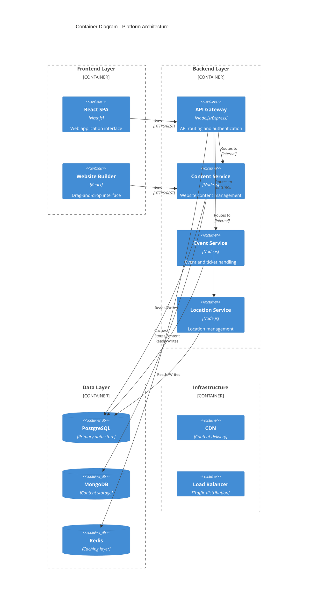

## 2.2 Component Details

### Frontend Components

| Component | Technology | Purpose | Scaling Strategy |
|-----------|------------|---------|------------------|
| SPA | Next.js/React | Main application interface | Edge caching, CDN distribution |
| Website Builder | React DnD | Drag-and-drop editor | Component lazy loading |
| Admin Dashboard | React | Management interface | Route-based code splitting |

### Backend Services

| Service | Technology | Responsibility | Data Store |
|---------|------------|----------------|------------|
| API Gateway | Express.js | Request routing, auth | Redis (sessions) |
| Content Service | Node.js | Website management | MongoDB, S3 |
| Event Service | Node.js | Event/ticket handling | PostgreSQL |
| Location Service | Node.js | Location management | PostgreSQL |

### Data Persistence

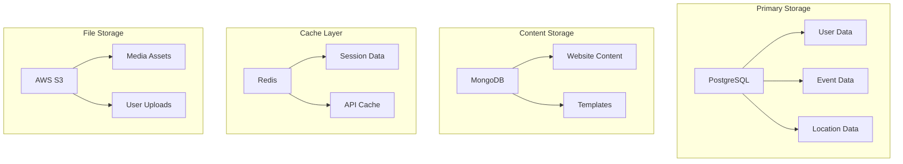

## 2.3 Technical Decisions

### Architecture Pattern Selection

| Pattern | Implementation | Justification |
|---------|---------------|---------------|
| Microservices | Domain-based services | Enables independent scaling and deployment |
| Event-driven | Message queues | Asynchronous processing for better performance |
| CQRS | Read/Write separation | Optimized query performance |

### Communication Patterns

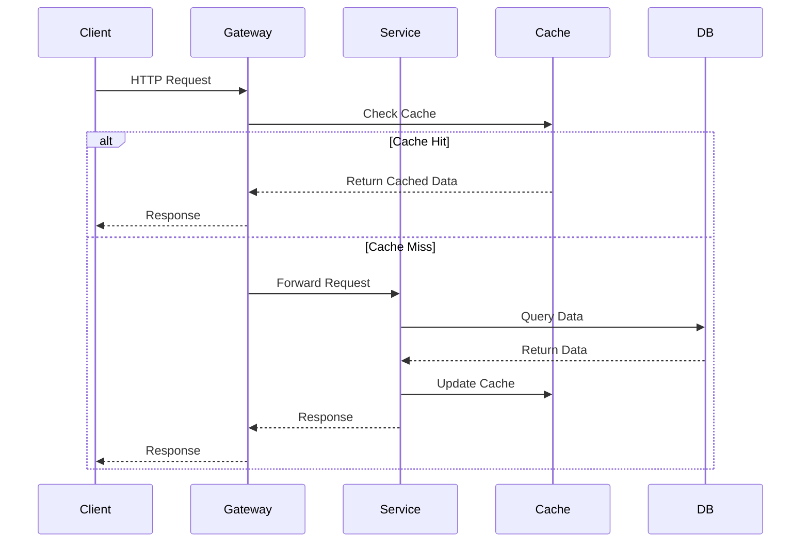

## 2.4 Cross-Cutting Concerns

### Monitoring and Security

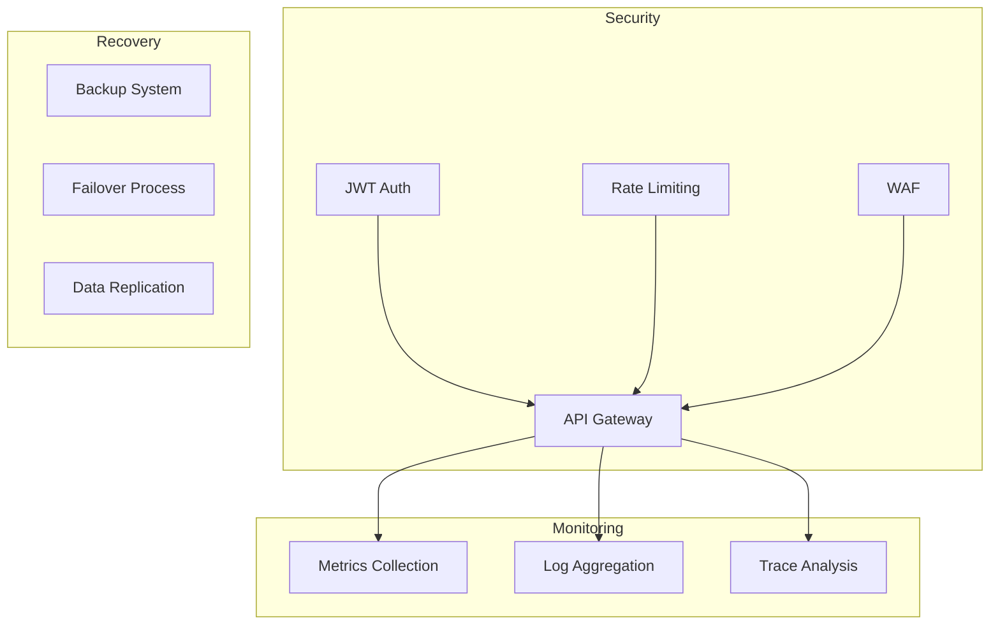

### Deployment Architecture

```mermaid
C4Deployment
    title Deployment Diagram

    Deployment_Node(cdn, "CDN", "Cloudflare") {
        Container(static, "Static Assets")
    }
    
    Deployment_Node(cloud, "Cloud Platform", "AWS") {
        Deployment_Node(web, "Web Tier") {
            Container(app, "Application Servers")
        }
        
        Deployment_Node(data, "Data Tier") {
            ContainerDb(db, "Databases")
            ContainerDb(cache, "Cache")
        }
        
        Deployment_Node(storage, "Storage") {
            Container(s3, "S3 Buckets")
        }
    }
    
    Rel(cdn, app, "Routes traffic")
    Rel(app, db, "Persists data")
    Rel(app, cache, "Caches data")
    Rel(app, s3, "Stores files")
```

# 3. SYSTEM COMPONENTS ARCHITECTURE

## 3.1 User Interface Design

### 3.1.1 Design System Specifications

| Component | Specification | Implementation Details |
|-----------|--------------|----------------------|
| Typography | Primary: Inter<br>Secondary: Lora | Font sizes: 12-40px<br>Line heights: 1.5-1.8<br>Weights: 400, 500, 600 |
| Colors | Primary: #2D3748<br>Secondary: #4A5568<br>Accent: #3182CE | Light mode background: #FFFFFF<br>Dark mode background: #1A202C<br>Error: #E53E3E |
| Spacing | Base unit: 4px<br>Grid: 8px | Margins: 16-32px<br>Padding: 8-24px<br>Gutters: 16px |
| Breakpoints | Mobile: 320px<br>Tablet: 768px<br>Desktop: 1024px | Container max-width: 1280px<br>Fluid until breakpoint |

### 3.1.2 Component Library

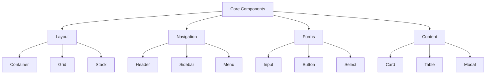

### 3.1.3 Critical User Flows

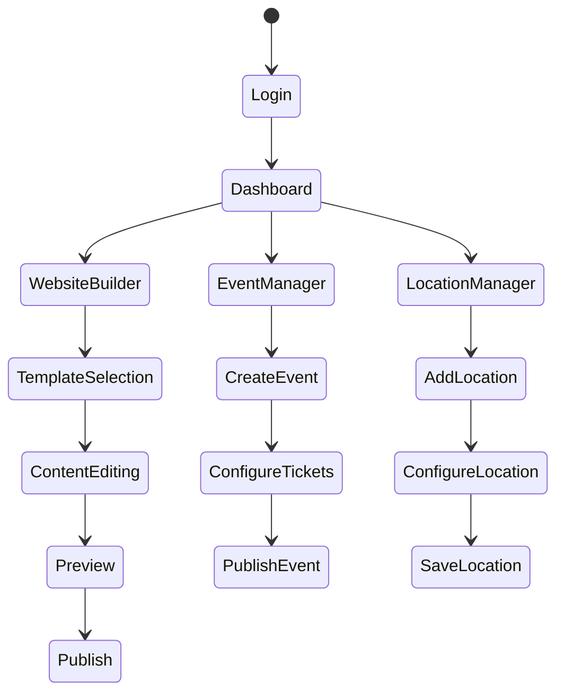

## 3.2 Database Design

### 3.2.1 Schema Design

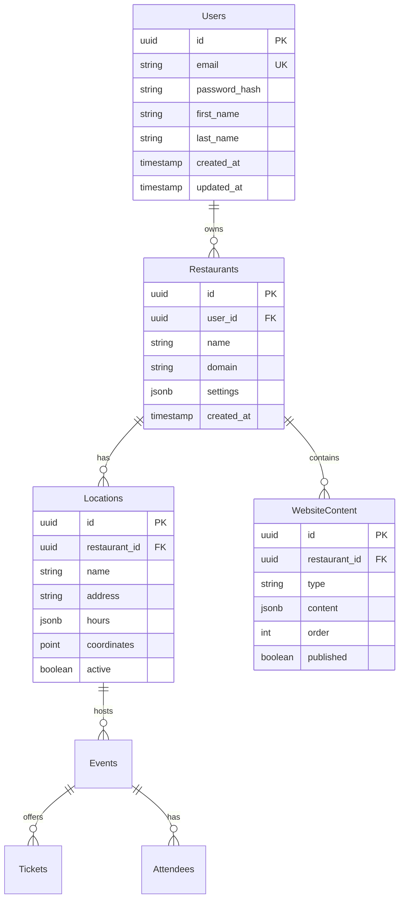

### 3.2.2 Data Management Strategy

| Aspect | Strategy | Implementation |
|--------|----------|----------------|
| Backups | Daily incremental<br>Weekly full | Retention: 30 days<br>Geographic redundancy |
| Archival | Quarterly cold storage | Compression: ZSTD<br>Encryption: AES-256 |
| Partitioning | By restaurant_id<br>By date range | Monthly event partitions<br>Location-based sharding |
| Indexing | B-tree primary keys<br>GiST spatial | Covering indexes for common queries<br>Partial indexes for active records |

### 3.2.3 Caching Strategy

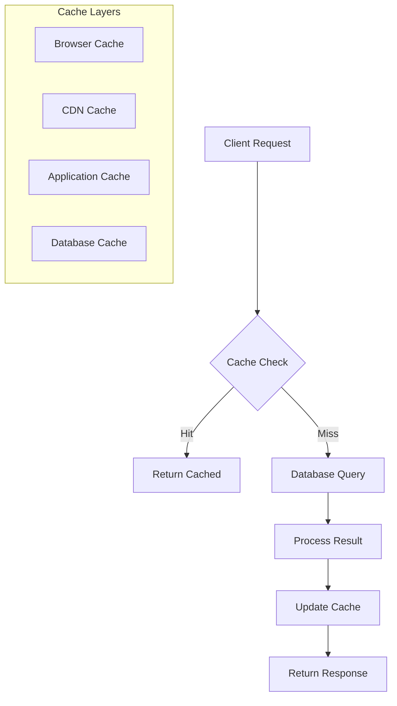

## 3.3 API Design

### 3.3.1 API Architecture

| Component | Specification | Details |
|-----------|--------------|----------|
| Protocol | REST over HTTPS | TLS 1.3 required |
| Authentication | JWT Bearer tokens | 24-hour expiration |
| Rate Limiting | 100 req/min per IP<br>1000 req/min per user | Burst: 200 req/min<br>Cooldown: 5 minutes |
| Versioning | URI-based (/v1/) | Deprecation notice: 6 months |

### 3.3.2 Endpoint Specifications

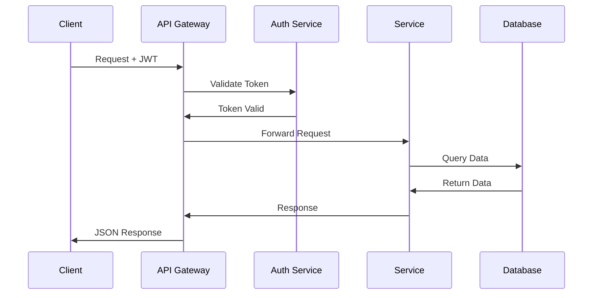

### 3.3.3 Integration Patterns

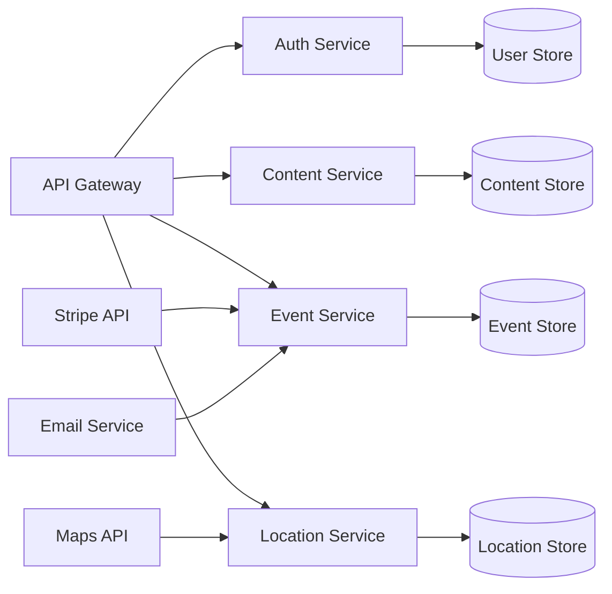

| Integration | Pattern | Fallback Strategy |
|-------------|---------|------------------|
| Payment | Synchronous REST | Retry with exponential backoff |
| Email | Async queue | Dead letter queue |
| Maps | Cache with refresh | Static coordinate fallback |
| Media | CDN with origin | Local storage fallback |

# 4. TECHNOLOGY STACK

## 4.1 PROGRAMMING LANGUAGES

| Platform | Language | Version | Justification |
|----------|----------|---------|---------------|
| Frontend | TypeScript | 5.0+ | Type safety, better IDE support, reduced runtime errors |
| Backend | Node.js | 18 LTS | JavaScript ecosystem compatibility, extensive package support |
| Database | SQL | PostgreSQL 15 | ACID compliance, relational data model support |
| Infrastructure | YAML/HCL | Latest | Infrastructure as code, declarative configuration |

## 4.2 FRAMEWORKS & LIBRARIES

### Core Frameworks

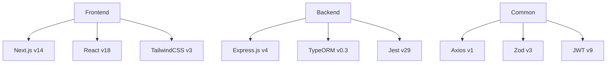

| Framework | Purpose | Justification |
|-----------|---------|---------------|
| Next.js 14 | Frontend Framework | Server-side rendering, optimized builds, API routes |
| React 18 | UI Library | Component reusability, virtual DOM, extensive ecosystem |
| Express.js 4 | Backend Framework | Lightweight, flexible routing, middleware support |
| TailwindCSS 3 | CSS Framework | Utility-first approach, responsive design, minimal bundle size |

### Supporting Libraries

| Category | Libraries | Purpose |
|----------|-----------|---------|
| State Management | Redux Toolkit | Centralized state, predictable updates |
| Form Handling | React Hook Form | Performance, validation, minimal re-renders |
| API Client | Axios | HTTP client, interceptors, request/response handling |
| Testing | Jest, React Testing Library | Unit testing, component testing |

## 4.3 DATABASES & STORAGE

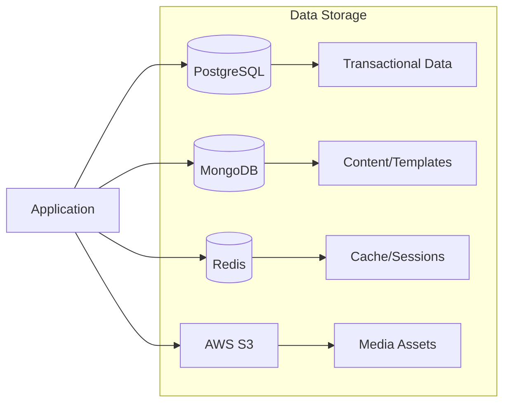

| Component | Technology | Purpose | Configuration |
|-----------|------------|---------|---------------|
| Primary DB | PostgreSQL 15 | Structured data | Multi-AZ, automated backups |
| Document Store | MongoDB 6 | Content storage | Replica set, atlas cloud |
| Cache | Redis 7 | Session/API cache | Cluster mode, persistence |
| Object Storage | AWS S3 | Media storage | Versioning, lifecycle policies |

## 4.4 THIRD-PARTY SERVICES

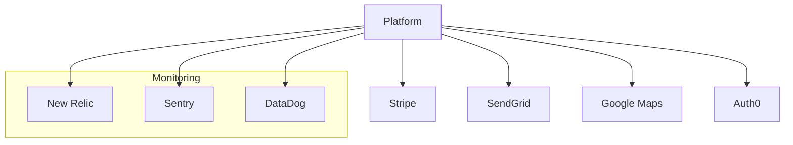

| Service | Purpose | Integration Method |
|---------|---------|-------------------|
| Stripe | Payment processing | REST API + Webhooks |
| SendGrid | Email delivery | SMTP + API |
| Google Maps | Location services | JavaScript SDK |
| Auth0 | Authentication | OAuth 2.0 |
| New Relic | Performance monitoring | Agent-based |
| Sentry | Error tracking | Client/server SDK |

## 4.5 DEVELOPMENT & DEPLOYMENT

### Development Pipeline

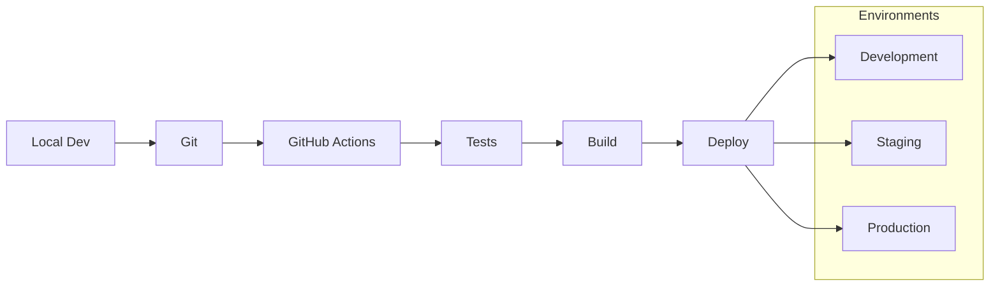

### Tools & Infrastructure

| Category | Technology | Purpose |
|----------|------------|---------|
| Version Control | Git | Source code management |
| CI/CD | GitHub Actions | Automated pipeline |
| Containerization | Docker | Consistent environments |
| Container Orchestration | AWS ECS | Container management |
| Infrastructure | Terraform | Infrastructure as code |
| Monitoring | Datadog | System monitoring |

### Development Requirements

| Tool | Version | Purpose |
|------|---------|----------|
| Node.js | 18 LTS | Runtime environment |
| npm | 9+ | Package management |
| Docker | 24+ | Containerization |
| Git | 2.40+ | Version control |
| VS Code | Latest | IDE |

### Deployment Architecture

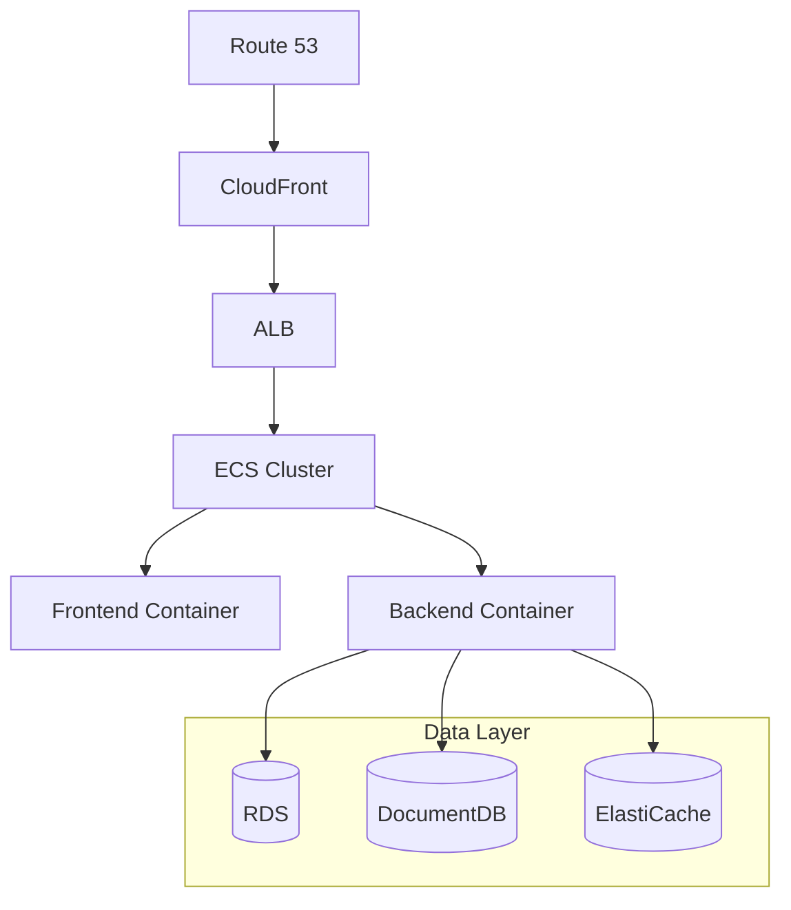

# 5. SYSTEM DESIGN

## 5.1 User Interface Design

### 5.1.1 Layout Structure

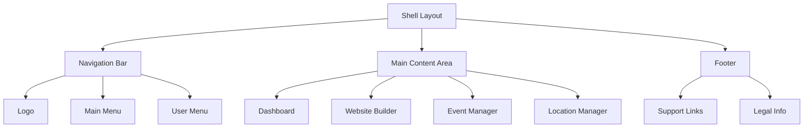

### 5.1.2 Core Components

| Component | Description | Behavior |
|-----------|-------------|-----------|
| Website Builder | Drag-and-drop interface | - Left sidebar with components<br>- Central preview area<br>- Right properties panel |
| Event Manager | Event creation/management | - Calendar/list toggle view<br>- Event detail forms<br>- Ticket configuration |
| Location Manager | Multi-location dashboard | - Map view with pins<br>- Location list<br>- Detail editor |

### 5.1.3 Responsive Breakpoints

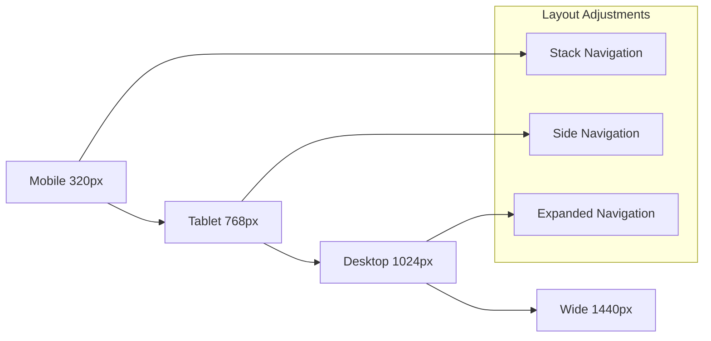

## 5.2 Database Design

### 5.2.1 Schema Overview

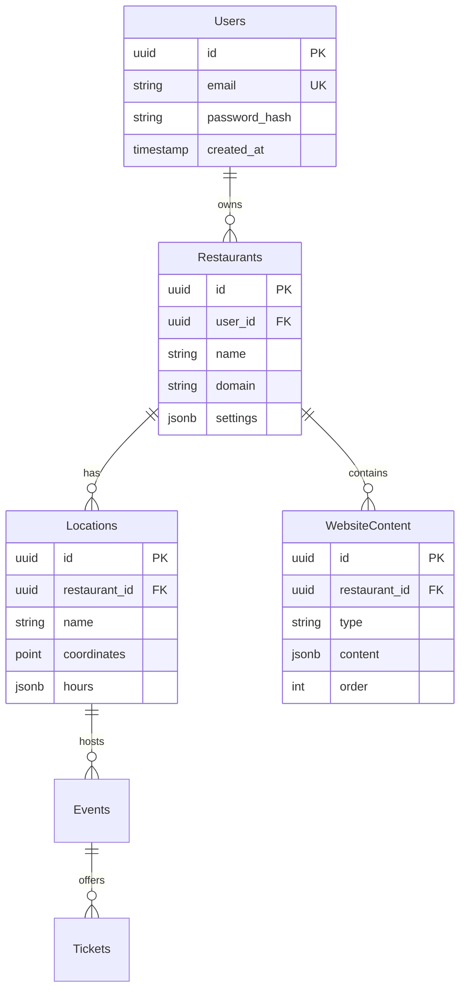

### 5.2.2 Data Storage Strategy

| Store Type | Technology | Purpose | Data Types |
|------------|------------|---------|------------|
| Relational | PostgreSQL | Structured data | Users, Events, Locations |
| Document | MongoDB | Flexible content | Website content, Templates |
| Cache | Redis | Session, API cache | Auth tokens, API responses |
| File | AWS S3 | Media storage | Images, Documents |

### 5.2.3 Indexing Strategy

| Table | Index Type | Fields | Purpose |
|-------|------------|--------|---------|
| Users | B-tree | email | Login lookups |
| Restaurants | B-tree | domain | Domain routing |
| Events | B-tree + GiST | location_id, date_range | Location/date queries |
| WebsiteContent | B-tree | restaurant_id, type | Content filtering |

## 5.3 API Design

### 5.3.1 REST Endpoints

| Endpoint | Method | Purpose | Auth Required |
|----------|--------|---------|---------------|
| /api/v1/websites | GET, POST | Website management | Yes |
| /api/v1/events | GET, POST | Event operations | Yes |
| /api/v1/locations | GET, POST | Location management | Yes |
| /api/v1/tickets | GET, POST | Ticket operations | Yes |

### 5.3.2 Authentication Flow

```mermaid
sequenceDiagram
    participant C as Client
    participant G as Gateway
    participant A as Auth Service
    participant S as Service
    
    C->>G: Request + JWT
    G->>A: Validate Token
    A->>G: Token Valid
    G->>S: Forward Request
    S->>G: Response
    G->>C: JSON Response
```

### 5.3.3 Data Flow

```mermaid
graph TD
    A[Client] --> B[API Gateway]
    B --> C{Auth Check}
    C -->|Valid| D[Service Router]
    C -->|Invalid| E[401 Response]
    
    D --> F[Website Service]
    D --> G[Event Service]
    D --> H[Location Service]
    
    F --> I[(PostgreSQL)]
    F --> J[(MongoDB)]
    G --> I
    H --> I
```

### 5.3.4 Response Format

| Status | Structure | Example |
|--------|-----------|---------|
| Success | `{status: 200, data: {}}` | `{status: 200, data: {id: "123"}}` |
| Error | `{status: 4xx, error: {}}` | `{status: 400, error: {message: "Invalid input"}}` |
| Validation | `{status: 422, errors: []}` | `{status: 422, errors: [{field: "email", message: "Required"}]}` |

### 5.3.5 Rate Limiting

| Tier | Rate | Burst | Window |
|------|------|-------|--------|
| Free | 100/min | 150 | 60s |
| Pro | 1000/min | 1500 | 60s |
| API | 5000/min | 7500 | 60s |

# 6. USER INTERFACE DESIGN

## 6.1 Common Elements

### Header Navigation
```
+----------------------------------------------------------+
| Logo    [#]Dashboard  [@]Profile  [?]Help  [=]Settings    |
+----------------------------------------------------------+
```

### Global Controls Key
```
[#] - Main Dashboard Menu
[@] - User Profile Access
[?] - Help/Support
[=] - Settings Menu
[!] - Alerts/Notifications
[x] - Close/Delete
[+] - Add New Item
[^] - Upload Media
[$] - Payment Related
[i] - Information
[<][>] - Navigation Controls
[*] - Featured/Important
```

## 6.2 Dashboard Interface

```
+----------------------------------------------------------+
| Logo    [#]Dashboard  [@]Profile  [?]Help  [=]Settings    |
+----------------------------------------------------------+
|                                                           |
|  Welcome back, Restaurant Owner                    [!] 2  |
|                                                           |
|  +-------------------+  +--------------------+            |
|  | Website Builder   |  | Event Manager      |            |
|  | [Last edit: 2h]   |  | [3 Active Events]  |            |
|  +-------------------+  +--------------------+            |
|                                                           |
|  +-------------------+  +--------------------+            |
|  | Location Manager  |  | Analytics          |            |
|  | [2 Locations]     |  | [^] 25% this week  |            |
|  +-------------------+  +--------------------+            |
|                                                           |
|  Recent Activity:                                         |
|  +--------------------------------------------------+    |
|  | • New event ticket sold - "Wine Tasting" [$]      |    |
|  | • Website content updated - "Menu Section"         |    |
|  | • New location added - "Downtown Branch"           |    |
|  +--------------------------------------------------+    |
|                                                           |
+----------------------------------------------------------+
```

## 6.3 Website Builder Interface

```
+----------------------------------------------------------+
| [<] Back to Dashboard                             [?]Help |
+----------------------------------------------------------+
|                                                           |
| Website Builder                        [Preview] [Publish] |
+----------------------------------------------------------+
|                      |                                    |
| Components          |     Content Area                   |
| +----------------+ |  +--------------------------------+ |
| | Header      [+]| |  |     [Restaurant Name]          | |
| | Menu        [+]| |  |     +-----------------+        | |
| | Gallery     [+]| |  |     |  Header Image  |        | |
| | Contact     [+]| |  |     |     [^]        |        | |
| | Events      [+]| |  |     +-----------------+        | |
| | Hours       [+]| |  |                                | |
| +----------------+ |  |     [Edit Text...]             | |
|                    |  |                                | |
| Style             |  +--------------------------------+ |
| +----------------+ |                                    |
| |Colors     [v] | |  Component Properties              |
| |Fonts      [v] | |  +--------------------------------+ |
| |Spacing    [v] | |  | Position: [v]                   | |
| +----------------+ |  | Size: [...] x [...]            | |
|                    |  | Background: [Color Picker]      | |
+--------------------+  +--------------------------------+ |
```

## 6.4 Event Manager Interface

```
+----------------------------------------------------------+
| [<] Back to Dashboard                             [?]Help |
+----------------------------------------------------------+
|                                                           |
| Events                                    [+ New Event]   |
+----------------------------------------------------------+
|                                                           |
| Active Events:                                            |
| +--------------------------------------------------+     |
| | Wine Tasting                                      |     |
| | Date: 2024-03-15  Time: 19:00                    |     |
| | Tickets Sold: [====--------] 40/100              |     |
| | [$]Revenue: $2,000         [Edit] [x]            |     |
| +--------------------------------------------------+     |
|                                                           |
| | Cooking Class                                     |     |
| | Date: 2024-03-20  Time: 18:00                    |     |
| | Tickets Sold: [==------------] 20/100            |     |
| | [$]Revenue: $1,000         [Edit] [x]            |     |
| +--------------------------------------------------+     |
|                                                           |
| Ticket Types:                                            |
| ( ) General Admission                                     |
| ( ) VIP Access                                           |
| ( ) Early Bird                                           |
|                                                           |
| [Save Changes]                                           |
+----------------------------------------------------------+
```

## 6.5 Location Manager Interface

```
+----------------------------------------------------------+
| [<] Back to Dashboard                             [?]Help |
+----------------------------------------------------------+
|                                                           |
| Locations                                [+ Add Location] |
+----------------------------------------------------------+
|                                                           |
| Location List:                                            |
| +--------------------------------------------------+     |
| | Main Restaurant                              [*]  |     |
| | 123 Main St, City                                 |     |
| | Hours: Mon-Sun 11:00-22:00                       |     |
| | [Edit Details] [Edit Menu] [Edit Events]         |     |
| +--------------------------------------------------+     |
|                                                           |
| | Downtown Branch                                   |     |
| | 456 Center Ave, City                             |     |
| | Hours: Mon-Sat 11:00-23:00                       |     |
| | [Edit Details] [Edit Menu] [Edit Events]         |     |
| +--------------------------------------------------+     |
|                                                           |
| Location Details:                                         |
| Name: [...]                                              |
| Address: [...]                                           |
| Phone: [...]                                             |
| Operating Hours:                                         |
| +--------------------------------------------------+     |
| | Mon: [09:00] to [22:00] [x]                      |     |
| | Tue: [09:00] to [22:00] [x]                      |     |
| | Wed: [09:00] to [22:00] [x]                      |     |
| +--------------------------------------------------+     |
|                                                           |
| [Save Changes]                                           |
+----------------------------------------------------------+
```

## 6.6 Mobile Responsive Layouts

### Mobile Dashboard
```
+----------------------+
| [=] Logo        [@] |
+----------------------+
| Welcome, Owner      |
|                     |
| +------------------+|
| | Website Builder  ||
| | [Last: 2h ago]   ||
| +------------------+|
|                     |
| +------------------+|
| | Event Manager    ||
| | [3 Events]       ||
| +------------------+|
|                     |
| +------------------+|
| | Locations        ||
| | [2 Active]       ||
| +------------------+|
|                     |
| Recent Activity     |
| • New ticket sale   |
| • Content update    |
| • Location added    |
+----------------------+
```

### Mobile Navigation
```
+----------------------+
| [=] Menu            |
+----------------------+
| • Dashboard         |
| • Website           |
| • Events            |
| • Locations         |
| • Settings          |
| • Help              |
| • Logout            |
+----------------------+
```

## 6.7 Interaction States

### Button States
```
Normal:    [Button]
Hover:     [Button]'
Active:    [Button]*
Disabled:  [Button]_
Loading:   [Button]...
```

### Form Validation
```
Valid:     [...✓]
Invalid:   [...!]
Required:  [...*]
Optional:  [...]
```

### Alert Types
```
Success:   [✓] Operation completed
Error:     [!] Error occurred
Warning:   [!] Warning message
Info:      [i] Information note
```

# 7. SECURITY CONSIDERATIONS

## 7.1 Authentication and Authorization

### Authentication Methods

| Method | Implementation | Use Case |
|--------|---------------|-----------|
| JWT Tokens | Access/Refresh token pair with 24h/7d expiry | Primary API authentication |
| Session Cookies | HTTP-only, Secure, SameSite=Strict | Website session management |
| OAuth 2.0 | Google, Facebook provider integration | Social login option |
| API Keys | UUID v4 with prefix `rest_` | External API access |

### Authorization Matrix

| Role | Website Management | Event Management | Location Management | User Management |
|------|-------------------|------------------|---------------------|-----------------|
| Owner | Full Access | Full Access | Full Access | Full Access |
| Manager | Edit/Publish | Create/Edit/Cancel | View/Edit | No Access |
| Staff | View Only | View/Check-in | View Only | No Access |
| API | Configured Access | Configured Access | Configured Access | No Access |

### Authentication Flow

```mermaid
sequenceDiagram
    participant U as User
    participant C as Client
    participant A as Auth Service
    participant S as Service
    participant D as Database

    U->>C: Login Request
    C->>A: Authenticate
    A->>D: Verify Credentials
    D-->>A: User Data
    A->>A: Generate JWT
    A-->>C: Access + Refresh Tokens
    C->>S: API Request + JWT
    S->>A: Validate Token
    A-->>S: Token Valid
    S->>D: Process Request
    D-->>S: Data
    S-->>C: Response
```

## 7.2 Data Security

### Encryption Standards

| Data Type | At Rest | In Transit | Key Management |
|-----------|----------|------------|----------------|
| User Credentials | Argon2id | TLS 1.3 | AWS KMS |
| Payment Data | Stripe Vault | TLS 1.3 | Stripe |
| Personal Info | AES-256-GCM | TLS 1.3 | AWS KMS |
| Session Data | AES-256-CBC | TLS 1.3 | Redis Encryption |

### Data Classification

```mermaid
graph TD
    A[Data Classification] --> B[Public]
    A --> C[Internal]
    A --> D[Confidential]
    A --> E[Restricted]
    
    B --> B1[Website Content]
    B --> B2[Event Details]
    
    C --> C1[Analytics Data]
    C --> C2[Logs]
    
    D --> D1[User Profiles]
    D --> D2[Contact Info]
    
    E --> E1[Passwords]
    E --> E2[Payment Data]
```

### Data Protection Measures

| Layer | Protection Measure | Implementation |
|-------|-------------------|----------------|
| Application | Input Validation | Zod Schema Validation |
| API | Rate Limiting | 100 req/min per IP |
| Database | Row-Level Security | PostgreSQL RLS Policies |
| Network | WAF | AWS WAF Rules |
| Infrastructure | Network Isolation | VPC + Security Groups |

## 7.3 Security Protocols

### Security Monitoring

```mermaid
graph LR
    A[Security Events] --> B[Log Aggregator]
    B --> C[SIEM]
    C --> D[Alert System]
    
    subgraph Monitoring
        E[Failed Logins]
        F[API Anomalies]
        G[Database Access]
        H[Infrastructure Changes]
    end
    
    E --> A
    F --> A
    G --> A
    H --> A
```

### Security Controls

| Control Type | Measure | Implementation |
|--------------|---------|----------------|
| Preventive | MFA | Time-based OTP |
| Detective | Audit Logging | CloudWatch Logs |
| Corrective | Auto-blocking | IP Reputation Check |
| Deterrent | Rate Limiting | Token Bucket Algorithm |

### Incident Response Plan

```mermaid
stateDiagram-v2
    [*] --> Detection
    Detection --> Analysis
    Analysis --> Containment
    Containment --> Eradication
    Eradication --> Recovery
    Recovery --> PostIncident
    PostIncident --> [*]
    
    Analysis --> Escalation
    Escalation --> Containment
```

### Security Compliance Requirements

| Standard | Requirement | Implementation |
|----------|-------------|----------------|
| GDPR | Data Privacy | Consent Management, Data Export |
| PCI DSS | Payment Security | Stripe Integration |
| SOC 2 | Security Controls | AWS Security Hub |
| CCPA | Data Rights | Privacy Dashboard |

### Security Update Process

```mermaid
graph TD
    A[Security Update Available] --> B{Severity Check}
    B -->|Critical| C[Emergency Patch]
    B -->|High| D[Next Release]
    B -->|Medium| E[Scheduled Update]
    B -->|Low| F[Backlog]
    
    C --> G[Deploy]
    D --> H[Test]
    H --> G
    E --> I[Sprint Planning]
    I --> H
    F --> I
```

# 8. INFRASTRUCTURE

## 8.1 DEPLOYMENT ENVIRONMENT

```mermaid
graph TD
    subgraph Production
        A[AWS Cloud] --> B[Multi-AZ Deployment]
        B --> C[Primary Region: us-east-1]
        B --> D[DR Region: us-west-2]
    end
    
    subgraph Staging
        E[AWS Cloud] --> F[Single AZ]
        F --> G[Region: us-east-1]
    end
    
    subgraph Development
        H[Local Environment] --> I[Docker Compose]
        H --> J[Vercel Preview]
    end
```

| Environment | Configuration | Purpose |
|-------------|--------------|----------|
| Production | Multi-AZ, Multi-Region | Live customer-facing environment |
| Staging | Single-AZ, Production Mirror | Pre-release testing and validation |
| Development | Local + Cloud Dev | Feature development and testing |
| DR | Cross-Region Backup | Business continuity |

## 8.2 CLOUD SERVICES

| Service | Purpose | Configuration |
|---------|---------|--------------|
| AWS ECS Fargate | Container hosting | Auto-scaling, spot instances |
| RDS PostgreSQL | Primary database | Multi-AZ, 15.x version |
| MongoDB Atlas | Content storage | Replica set, M10 cluster |
| ElastiCache Redis | Session/caching | Cluster mode enabled |
| S3 | Media storage | Versioning enabled |
| CloudFront | CDN | Edge locations worldwide |
| Route 53 | DNS management | Latency-based routing |
| ACM | SSL certificates | Auto-renewal enabled |

```mermaid
graph TB
    subgraph Frontend
        A[CloudFront] --> B[S3 Static Assets]
        A --> C[ECS Frontend Service]
    end
    
    subgraph Backend
        C --> D[Application Load Balancer]
        D --> E[ECS Backend Services]
        E --> F[RDS PostgreSQL]
        E --> G[MongoDB Atlas]
        E --> H[ElastiCache Redis]
    end
    
    subgraph Monitoring
        I[CloudWatch]
        J[X-Ray]
        K[AWS Backup]
    end
```

## 8.3 CONTAINERIZATION

### Docker Configuration

| Component | Base Image | Optimizations |
|-----------|------------|---------------|
| Frontend | node:18-alpine | Multi-stage build, npm ci |
| Backend | node:18-alpine | Multi-stage build, pm2 |
| Nginx | nginx:alpine | Custom configuration, compression |

```mermaid
graph LR
    subgraph Container Architecture
        A[Nginx Container] --> B[Frontend Container]
        A --> C[Backend Container]
        C --> D[Cache Container]
    end
    
    subgraph Image Layers
        E[Base Image]
        F[Dependencies]
        G[Application Code]
        H[Configuration]
    end
```

## 8.4 ORCHESTRATION

### ECS Configuration

| Service | Task Definition | Scaling Policy |
|---------|----------------|----------------|
| Frontend | 2 vCPU, 4GB RAM | Target tracking - 70% CPU |
| Backend | 2 vCPU, 4GB RAM | Target tracking - 70% CPU |
| Worker | 1 vCPU, 2GB RAM | Queue depth based |

```mermaid
graph TD
    subgraph ECS Cluster
        A[Application Load Balancer] --> B[Frontend Service]
        A --> C[Backend Service]
        D[Auto Scaling Group] --> B
        D --> C
        E[Worker Service] --> F[SQS Queue]
    end
```

## 8.5 CI/CD PIPELINE

```mermaid
graph LR
    A[GitHub] --> B[GitHub Actions]
    B --> C{Tests Pass?}
    C -->|Yes| D[Build Images]
    C -->|No| E[Notify Team]
    D --> F[Push to ECR]
    F --> G{Branch?}
    G -->|Main| H[Deploy Production]
    G -->|Staging| I[Deploy Staging]
    G -->|Feature| J[Deploy Preview]
```

### Pipeline Stages

| Stage | Tools | Actions |
|-------|-------|---------|
| Code Analysis | ESLint, SonarQube | Style checks, security scanning |
| Testing | Jest, Cypress | Unit tests, E2E tests |
| Build | Docker | Multi-stage builds, layer caching |
| Security Scan | Snyk, Trivy | Container/dependency scanning |
| Deployment | AWS CDK | Infrastructure as Code deployment |
| Monitoring | DataDog, Sentry | Performance and error tracking |

### Environment Promotion

```mermaid
stateDiagram-v2
    [*] --> Feature
    Feature --> Development
    Development --> Staging
    Staging --> Production
    Production --> [*]
    
    Development --> Feature: Failed Tests
    Staging --> Development: Failed Tests
    Production --> Staging: Failed Tests
```

# APPENDICES

## A.1 Additional Technical Information

### A.1.1 Development Environment Setup

| Component | Version | Configuration |
|-----------|---------|---------------|
| Node.js | 18 LTS | `nvm use 18` |
| npm | 9.x | `npm config set registry https://registry.npmjs.org/` |
| Docker | 24.x | `buildkit=1`, `experimental=true` |
| Git | 2.40+ | `core.autocrlf=input` |
| VS Code | Latest | Extensions: ESLint, Prettier, Docker |

### A.1.2 Code Quality Standards

```mermaid
graph TD
    A[Code Quality] --> B[Static Analysis]
    A --> C[Testing]
    A --> D[Documentation]
    
    B --> B1[ESLint]
    B --> B2[TypeScript]
    B --> B3[SonarQube]
    
    C --> C1[Unit Tests]
    C --> C2[Integration Tests]
    C --> C3[E2E Tests]
    
    D --> D1[JSDoc]
    D --> D2[Swagger/OpenAPI]
    D --> D3[README files]
```

### A.1.3 Error Handling Standards

| Error Type | Handling Strategy | Example |
|------------|------------------|----------|
| Validation Errors | 422 Unprocessable Entity | Invalid form data |
| Authentication Errors | 401 Unauthorized | Invalid/expired token |
| Authorization Errors | 403 Forbidden | Insufficient permissions |
| Resource Errors | 404 Not Found | Invalid resource ID |
| Server Errors | 500 Internal Server Error | Database connection failure |

## A.2 GLOSSARY

| Term | Definition |
|------|------------|
| Blitzy | AI-assisted development tool used for code generation and optimization |
| Content Block | Modular website component that can be arranged via drag-and-drop |
| Edge Caching | Content caching at CDN edge locations for faster delivery |
| Hot Reload | Development feature allowing real-time code changes without full refresh |
| Hydration | Process of attaching JavaScript handlers to server-rendered HTML |
| Microservice | Independent service handling specific business domain functionality |
| Rate Limiting | Controlling the number of requests a user can make in a time period |
| Server-Side Rendering | Pre-rendering React components on the server for better SEO |
| Webhook | HTTP callback triggered by specific system events |
| Zero Downtime Deployment | Deployment strategy ensuring continuous service availability |

## A.3 ACRONYMS

| Acronym | Full Form | Context |
|---------|-----------|---------|
| API | Application Programming Interface | Service communication |
| CDN | Content Delivery Network | Asset distribution |
| CQRS | Command Query Responsibility Segregation | Architecture pattern |
| DDD | Domain-Driven Design | Software design approach |
| DNS | Domain Name System | Domain management |
| JWT | JSON Web Token | Authentication |
| MFA | Multi-Factor Authentication | Security feature |
| ORM | Object-Relational Mapping | Database interaction |
| REST | Representational State Transfer | API architecture |
| RLS | Row-Level Security | Database security |
| S3 | Simple Storage Service | File storage |
| SDK | Software Development Kit | Development tools |
| SEO | Search Engine Optimization | Website visibility |
| SPA | Single Page Application | Frontend architecture |
| SQL | Structured Query Language | Database queries |
| SSL | Secure Sockets Layer | Data encryption |
| TLS | Transport Layer Security | Security protocol |
| URL | Uniform Resource Locator | Web addressing |
| UUID | Universally Unique Identifier | Resource identification |
| WAF | Web Application Firewall | Security component |

## A.4 Development Standards

```mermaid
graph LR
    A[Development Standards] --> B[Code Style]
    A --> C[Testing]
    A --> D[Documentation]
    A --> E[Security]
    
    B --> B1[ESLint Rules]
    B --> B2[Prettier Config]
    B --> B3[TypeScript Config]
    
    C --> C1[Jest]
    C --> C2[Cypress]
    C --> C3[React Testing Library]
    
    D --> D1[JSDoc]
    D --> D2[API Docs]
    D --> D3[README]
    
    E --> E1[OWASP Top 10]
    E --> E2[Security Headers]
    E --> E3[Input Validation]
```

## A.5 Monitoring and Alerting

| Metric Type | Tools | Thresholds |
|-------------|-------|------------|
| Application Performance | New Relic | Response time > 500ms |
| Error Tracking | Sentry | Error rate > 1% |
| Infrastructure | DataDog | CPU > 80%, Memory > 85% |
| Security | AWS GuardDuty | Any high severity finding |
| Availability | Pingdom | Uptime < 99.9% |